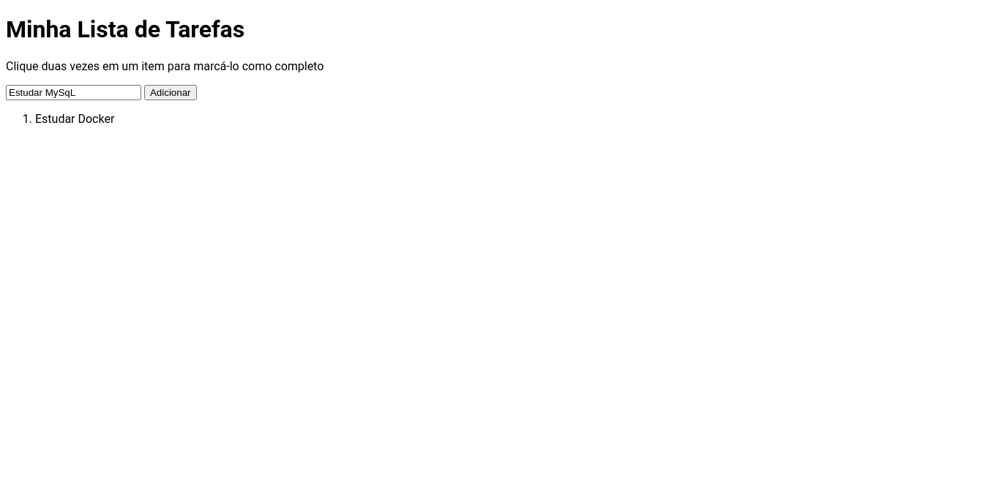

# Trybe Project ToDo List 09/07/2021
 

  
  
  

 

## Habilidades

- Manipular CSS;
- Manipular Javascript.

## Desenvolvimento
[Lista de tarefas](https://weltonthomasferreira.github.io/trybe-project-todo-list/) usando `HTML`, `CSS` e `JavaScript`.

## Resultados

- `3` dia de projeto;
- `14` requisitos;
- Percentual de cumprimento de requisitos obrigatórios `81.82%`;
- Percentual de cumprimento de requisitos totais `64.29%`.

